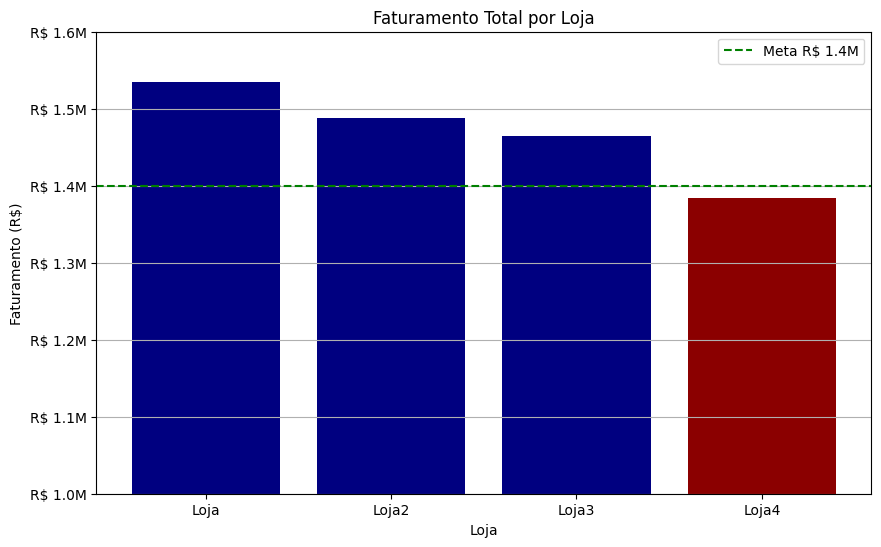

# Challenge ONE Data Science: Alura Store - Mateus Souza

## Desafio AluraStoreBr

Esse desafio visava trazer um detalhamento com base em dados das operações das 4 lojas Seu João, realizamos diversos levantamentos como: A loja com maior rendimento, os rendimentos de todos os tipos de produto, qual produto vendia mais ou menos, a média do frete e a média de avaliação de cada loja. 

> Utilizamos o escopo dado pelo desafio apenas.

Lista não ordenada:
- Faturamento total de cada Loja
- Vendas por categoria
- Média de avaliação
- Produtos mais ou menos vendidos
- Frete Médio por loja
  
## Ferramentas

Utilizamos como ferramenta o **Python** unido ao **Numpy** e ao **Pandas** pare realizar a extração de dados e sua análise, e junto usamos a ferramenta do **Matplotlib** para a geração dos gráficos.

## Relatório final

Essa análise tem como objetivo ajudar a Loja Seu João a potencializar suas vendas através dos dados que a mesma apresenta, com o registro retirado de suas planilhas conseguimos levantar comparativo com dados e por fim realizar uma plano estratégico.

Primeiro levamos em conta a análise de **faturamento total das lojas**, e traçamos junto ao time de vendas uma meta inicial de 14 milhoes para as mesmas, quase todas conseguiram atingir essa futura meta com base nos dados do passado, ficando apenas a Loja4 para correr atrás desse número como podem ver abaixo no gráfico:

Em seguida tratamos de entender melhor como era a parcela de **produtos mais e menos vendidos** das lojas Seu João e tivemos o seguinte gráfico:

A análise de dados apontou uma boa diversificação nos produtos do Seu joão, e apesar de ter mais vendas em um setor mais pontual, acreditamos que deva manter suas vendas mais abrangentes para trazer o maior número possível de consumidores para sua loja em uma lógica de mercado.

O produto mais vendido e menos vendido de cada loja foi também avaliado:

Os valores variam muito não tendo um produto em particular que se destaca em todas as lojas assim como os que vendem menos, teriamos que realizar um levantamento de que produtos em especifico rendem mais em cada loja, para ter uma maior clareza da situação atual das vendas, mas como dito anteriormente nichar o setor de vendas pode trazer problemas de ofertas de produto de mercado, e reduzir o movimento de clientes que possam fazer vendas em paralelo ao produto alvo.

Avaliamos também a média de avaliação que a loja tem, criando uma linha de meta apra as lojas bater de satisfação do cliente setado na nota 4 como podem ver no gráfico:

Em destaque a Loja 1 que apesar de ter um faturamento maior apresentou uma média avaliação abaixo do desejado, enquanto a Loja 4 além de ter um faturamento abaixo da meta também apresentou uma meta de avaliação baixa.

Por fim temos o frete médio de cada loja em uma análise:

Tendo a Loja 4 com o valor de frente com 2 reais aproximadamente de valor abaixo da média, o que acaba podendo ser um valor de negociação acaba não trazendo tanto resultado assim comparado aos valores acima das demais lojas.

## Conclusão

A Loja João precisa de mais profundez na análise de dados para dar um retorno satisfatório, incluir talvez o produto em si que rende mais e não o mais vendido pode dar um retorno mais decisivo para uma ação. Assim como entender como os custos do frete realmente afetam a receita da loja uma vez que é um serviço tercerizado que pode ser pago pelo cliente. Contudo foi um bom serviço de observação, que pode melhorar com o futuro.
